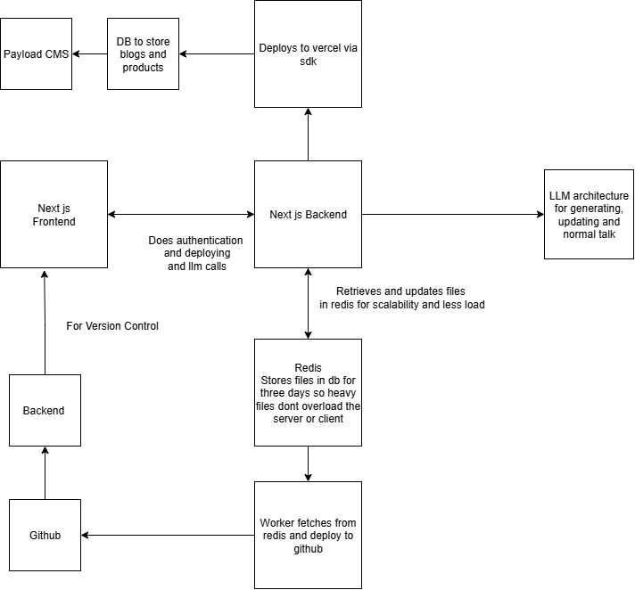
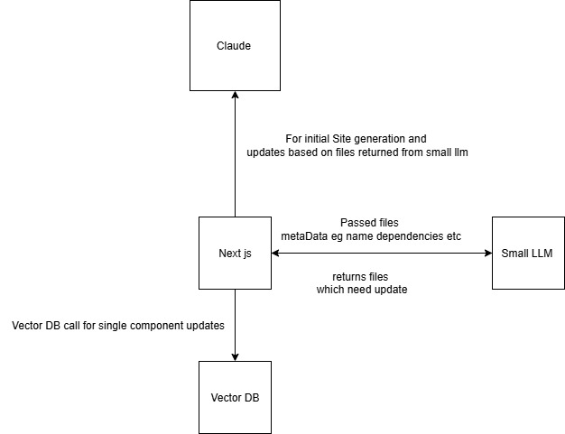

# Architecture Diagrams

## CoMarketer Architecture

This diagram illustrates the overall architecture of the CoMarketer application, showing the main components and their interactions.

## LLM Architecture

This diagram depicts the architecture of the Large Language Model (LLM) integration within the CoMarketer system, highlighting the flow of data and key modules involved. 